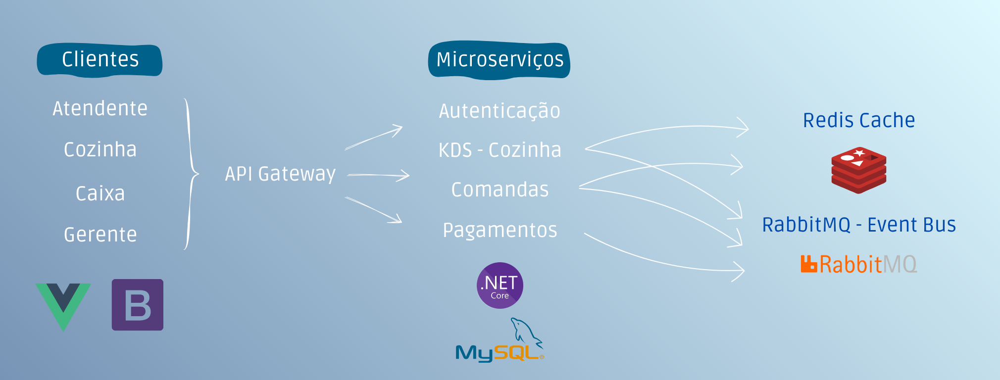

# Introdução

 Com o avanço da tecnologia e a busca constante por praticidade, o setor de alimentação tem investido em soluções digitais para otimizar operações e fidelizar clientes. A agilidade no atendimento, o controle eficiente dos processos e a integração entre salão, cozinha e caixa tornaram-se fatores decisivos para a competitividade dos restaurantes. Nesse contexto, a adoção de sistemas de gestão integrados (ERP) surge como uma estratégia essencial. O aplicativo/site proposto centraliza todas as etapas do atendimento em uma única plataforma — da abertura da comanda ao pagamento — oferecendo maior eficiência, redução de falhas, insights gerenciais e uma experiência mais satisfatória para o cliente.

## Problema
 Muitos restaurantes ainda enfrentam dificuldades operacionais por utilizarem processos manuais ou sistemas não integrados. Entre os principais problemas estão:
  * Falta de integração entre salão, cozinha e caixa, resultando em atrasos nos pedidos.
  * Erros de comunicação entre garçom e cozinha, que comprometem a entrega correta dos pratos.
  * Ausência de controle efetivo de estoque e insumos, ocasionando desperdícios ou falta de produtos.
  * Gestão financeira pouco precisa, dificultando tomadas de decisão.
  * Carência de relatórios gerenciais que auxiliem na estratégia do negócio.
  * Experiência do cliente prejudicada, marcada por esperas longas, pedidos incorretos, pagamentos pouco práticos e ausência de ferramentas de fidelização.
 Essas falhas impactam não apenas a eficiência interna, mas também a satisfação e a fidelidade dos clientes, que cada vez mais buscam rapidez, conveniência e qualidade no atendimento.

## Objetivos

 O aplicativo/site de ERP para restaurantes tem como principais objetivos:
  * Automatizar e integrar processos do atendimento ao cliente, cozinha e caixa.
  * Reduzir erros operacionais, garantindo que os pedidos sejam enviados corretamente e no tempo adequado.
  * Controlar estoque e insumos em tempo real, evitando desperdícios e faltas.
  * Oferecer relatórios gerenciais que apoiem na tomada de decisões estratégicas.
  * Melhorar a experiência do cliente, com atendimento mais rápido, pagamentos simplificados e maior transparência.

## Justificativa

A implantação de um ERP voltado para restaurantes justifica-se pela necessidade crescente de modernização do setor, que demanda soluções práticas e integradas. Com a concorrência cada vez mais acirrada e a exigência dos clientes por agilidade e qualidade no atendimento, investir em tecnologia é essencial para garantir a sustentabilidade do negócio.
Além disso, a centralização das informações em uma única plataforma permite maior controle gerencial, redução de custos operacionais e aumento da lucratividade. Dessa forma, o aplicativo/site não é apenas uma ferramenta de gestão, mas um diferencial estratégico que contribui para o crescimento e fortalecimento do restaurante no mercado.

## Público-Alvo

1. Perfil do Negócio
 * Restaurantes de pequeno a médio porte que buscam digitalizar seus processos.
 * Redes de restaurantes que necessitam de padronização e integração entre unidades.
 * Bares, lanchonetes, cafés e pizzarias, que também compartilham as mesmas necessidades de controle de pedidos, estoque e caixa.

2. Perfil do Usuário
 * Gestores e proprietários de restaurantes, que desejam ter controle financeiro, de estoque e relatórios gerenciais para tomada de decisão.
 * Garçons e atendentes, que precisam de uma solução prática para abertura de comandas, anotações de pedidos e agilidade no atendimento.
 * Equipe de cozinha, que depende da comunicação clara e rápida para preparação dos pedidos.
 * Caixa e equipe administrativa, responsáveis pelo fechamento de contas, conciliação de pagamentos e emissão de notas fiscais.

3. Necessidades do Público
 * Reduzir erros em pedidos e pagamentos.
 * Melhorar a experiência do cliente no atendimento.
 * Integrar diferentes etapas do serviço (salão, cozinha, caixa).
 * Obter relatórios claros para decisões estratégicas.
 * Ter uma ferramenta intuitiva, de fácil uso e acessível em dispositivos móveis e web.

# Especificações do Projeto

## Requisitos

Técnica Utilizada: MoSCoW
Uma técnica é muito usada em projetos ágeis. Ela classifica os requisitos em quatro categorias:

 * Must Have (Obrigatório) → Essenciais, sem eles o sistema não funciona.
 * Should Have (Importante) → Muito relevante, mas o sistema pode operar sem eles no início.
 * Could Have (Desejável) → São diferenciais, agregam valor, mas não são urgentes.
 * Won’t Have (Não será incluído agora) → Fora do escopo da versão inicial, mas podem ser considerados futuramente.

### Requisitos Funcionais

|ID    | Descrição do Requisito  | Prioridade |
|------|-----------------------------------------|----|
|RF-001| O sistema deve permitir que sejam criados usuários com suas respectivas funções            | OBRIGATÓRIO | 
|RF-002| O atendente deve conseguir registrar pedidos no aplicativo                                 | OBRIGATÓRIO |
|RF-003| O sistema deve enviar os pedidos automaticamente para a cozinha em tempo real              | OBRIGATÓRIO |
|RF-004| A cozinha deve visualizar os pedidos recebidos com detalhes (mesa, itens, observações)     | OBRIGATÓRIO |
|RF-005| A cozinha deve poder marcar o pedido como “em preparo”, “pronto” ou “cancelado”            | OBRIGATÓRIO |
|RF-006| O atendente deve receber uma notificação imediata quando o pedido estiver pronto           | OBRIGATÓRIO |
|RF-007| O sistema deve permitir adicionar observações específicas (ex: sem cebola, ponto da carne) | OBRIGATÓRIO |
|RF-008| O sistema deve permitir múltiplos atendentes e cozinheiros conectados simultaneamente      | IMPORTANTE |
|RF-009| O sistema deve registrar o horário de entrada e finalização de cada pedido                 | IMPORTANTE |
|RF-010| O sistema deve permitir visualizar o histórico de pedidos por mesa ou atendente            | IMPORTANTE |
|RF-011| O sistema deve permitir integração com o sistema de pagamento ou fechamento de conta       | DESEJÁVEL |
|RF-012| Emitir relatórios de vendas por período, prato, garçom ou canal de venda                   | IMPORTANTE |
|RF-013| Gerar relatórios financeiros (contas a pagar/receber, fluxo de caixa)                      | DESEJÁVEL |
|RF-014| Permitir exportação de relatórios em PDF/Excel                                             | DESEJÁVEL |
|RF-015| Cadastrar clientes com dados básicos                                                       | DESEJÁVEL |
|RF-016| Controlar programas de fidelidade (pontos, promoções, descontos)                           | DESEJÁVEL |
|RF-017| Calcular automaticamente o valor total da comanda                                          | OBRIGATÓRIO |
|RF-018| Permitir pagamento direto com o garçom (cartão, pix, dinheiro)                             | IMPORTANTE |
|RF-019| Permitir pagamento no caixa via aplicação web                                              | OBRIGATÓRIO |

### Requisitos não Funcionais

|ID     | Descrição do Requisito  |Prioridade |
|-------|-------------------------|----|
|RNF-001| A interface deve ser intuitiva e fácil de usar para usuários com pouca experiência digital                              | OBRIGATÓRIO | 
|RNF-002| O tempo de resposta para envio e recebimento de pedidos deve ser inferior a 2 segundos                                  | IMPORTANTE | 
|RNF-003| A tela da cozinha deve atualizar automaticamente sem necessidade de refresh manual                                      | OBRIGATÓRIO | 
|RNF-004| O sistema deve garantir segurança dos dados dos clientes e pedidos                                                      | OBRIGATÓRIO | 
|RNF-005| O sistema deve funcionar mesmo com conexão instável, sincronizando dados assim que possível                             | DESEJÁVEL | 
|RNF-006| O sistema deve permitir operação offline com sincronização posterior                                                    | DESEJÁVEL | 
|RNF-007| O sistema deve ter alta disponibilidade (mínimo de 99% de uptime)                                                       | DESEJÁVEL | 
|RNF-008| O sistema deve ser escalável para atender restaurantes com diferentes tamanhos e fluxos                                 | DESEJÁVEL | 
|RNF-009| O sistema deve registrar logs de operação para auditoria e suporte técnico                                              | IMPORTANTE | 
|RNF-010| O sistema deve ser responsivo e funcionar em smartphones, tablets e desktops                                            | OBRIGATÓRIO | 
|RNF-011| O código deve ser modular e seguir boas práticas de arquitetura, permitindo atualizações sem afetar o sistema existente | OBRIGATÓRIO | 

## Restrições

O projeto está restrito pelos itens apresentados na tabela a seguir.

|ID| Restrição                                             |
|--|-------------------------------------------------------|
|01| O sistema será desenvolvido apenas como protótipo funcional, sem necessidade de atender a todas as integrações fiscais e bancárias reais |
|02| O banco de dados será limitado a uma solução acadêmica |
|03| A infraestrutura de hospedagem pode ser local (localhost) |
|04| Recursos avançados de segurança não serão implementados, apenas boas práticas básicas        |
|05| As funcionalidades serão priorizadas para demonstração didática, não necessariamente cobrindo todas as exigências legais de um restaurante real |
|06| O escopo deve ser limitado ao que é possível implementar no período do projeto |
|07| O projeto deve ser entregue no prazo estipulado pelo cronograma da disciplina (até o fim do semestre) |
|08| O tempo de desenvolvimento é limitado ao calendário acadêmico |
|09| A equipe de desenvolvimento será composta apenas pelos integrantes do grupo da disciplina |
|10| O sistema deve ser simples e intuitivo, já que o tempo para treinar e demonstrar é curto |
|11| A prioridade é a apresentação visual e a prova de conceito, não a robustez total do sistema |

# Catálogo de Serviços

 * Gestão de Comandas: Abertura, edição e fechamento de comandas pelo garçom, com registro/alteração de itens e envio automático à cozinha (KDS). Exibe o retorno de pratos prontos para entrega e permite divisão de conta no fechamento.
    * Abrir/fechar comanda (por mesa, balcão).
    * Adicionar, editar e remover itens (quantidade, observações, substituições).
    * Envio dos pedidos/itens ao KDS por estação (cozinha, bar, sobremesas).
    * Atualização de status: em preparo → pronto → entregue.
    * Divisão de conta (igual, por item, por valor ou por pessoa).
    * Visualização de “pratos prontos” pendentes de entrega.
     
 * KDS – Tela da Cozinha: Exibição em tempo real dos pedidos na cozinha. Recebe itens enviados pelo salão, organiza por prioridade/estação, permite mudar status (em preparo → pronto) e integra com o fluxo de entrega pelo garçom.
   * Visualização de pedidos por fila/estação (grelha, fritura, massas, bar, sobremesas).
   * Ações rápidas por item/comanda: aceitar, iniciar preparo, marcar como pronto, anexar observações.
   * Feedback ao salão: quando item/comanda fica pronto para entrega.
    
 * Pagamentos: Fechamento da comanda e registro do pagamento, permitindo múltiplos métodos (dinheiro, cartão, PIX), divisão de conta e emissão de comprovantes. Pode ser realizado diretamente com o garçom (via app/maquininha) ou no caixa (via aplicação web).
   * Cálculo automático do valor total da comanda, incluindo descontos e taxas.
   * Pagamento com múltiplos métodos (dinheiro, cartão, PIX).
   * Divisão de conta (igual, por item, por valor ou por pessoa).
   * Registro do pagamento no sistema, com histórico por comanda.
   * Cancelamento/estorno de pagamentos (com motivo e usuário registrado).

# Arquitetura da Solução

Definição de como o software é estruturado em termos dos componentes que fazem parte da solução e do ambiente de hospedagem da aplicação.

## Tecnologias Utilizadas

O FoodTrack é composto por um backend em .NET 8 (APIs REST), um frontend SPA em Vue 3, e um banco relacional MySQL. Integra-se a módulos internos (KDS/cozinha, comanda, pagamentos) e serviços externos (provedor de pagamentos, mensageria). Usuários: atendente, cozinha, caixa, gerente.

Descreva aqui qual(is) tecnologias você vai usar para resolver o seu problema, ou seja, implementar a sua solução. Liste todas as tecnologias envolvidas, linguagens a serem utilizadas, serviços web, frameworks, bibliotecas, IDEs de desenvolvimento, e ferramentas.

Apresente também uma figura explicando como as tecnologias estão relacionadas ou como uma interação do usuário com o sistema vai ser conduzida, por onde ela passa até retornar uma resposta ao usuário.

## Hospedagem

Explique como a hospedagem e o lançamento da plataforma foi feita.

# Planejamento

##  Quadro de tarefas

> Apresente a divisão de tarefas entre os membros do grupo e o acompanhamento da execução, conforme o exemplo abaixo.

### Semana 1

Atualizado em: 21/04/2024

| Responsável   | Tarefa/Requisito | Iniciado em    | Prazo      | Status | Terminado em    |
| :----         |    :----         |      :----:    | :----:     | :----: | :----:          |
| AlunaX        | Introdução | 01/02/2024     | 07/02/2024 | ✔️    | 05/02/2024      |
| AlunaZ        | Objetivos    | 03/02/2024     | 10/02/2024 | 📝    |                 |
| AlunoY        | Histórias de usuário  | 01/01/2024     | 07/01/2005 | ⌛     |                 |
| AlunoK        | Personas 1  |    01/01/2024        | 12/02/2005 | ❌    |       |

#### Semana 2

Atualizado em: 21/04/2024

| Responsável   | Tarefa/Requisito | Iniciado em    | Prazo      | Status | Terminado em    |
| :----         |    :----         |      :----:    | :----:     | :----: | :----:          |
| AlunaX        | Página inicial   | 01/02/2024     | 07/03/2024 | ✔️    | 05/02/2024      |
| AlunaZ        | CSS unificado    | 03/02/2024     | 10/03/2024 | 📝    |                 |
| AlunoY        | Página de login  | 01/02/2024     | 07/03/2024 | ⌛     |                 |
| AlunoK        | Script de login  |  01/01/2024    | 12/03/2024 | ❌    |       |

Legenda:
- ✔️: terminado
- 📝: em execução
- ⌛: atrasado
- ❌: não iniciado
