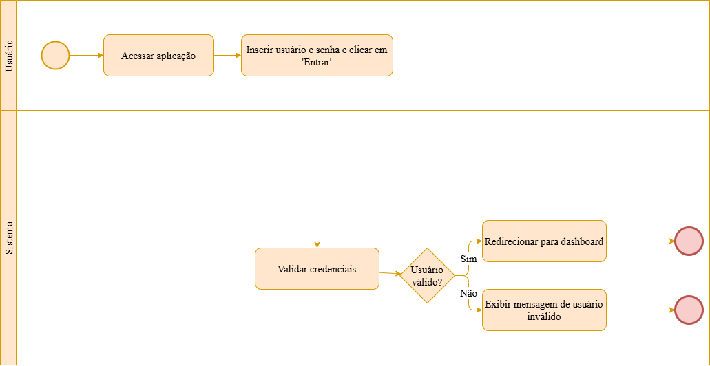
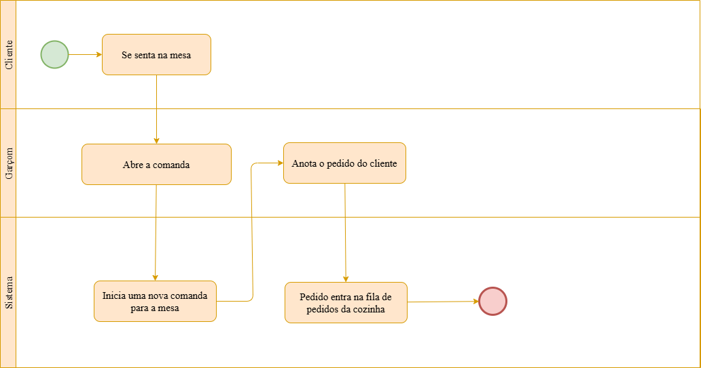
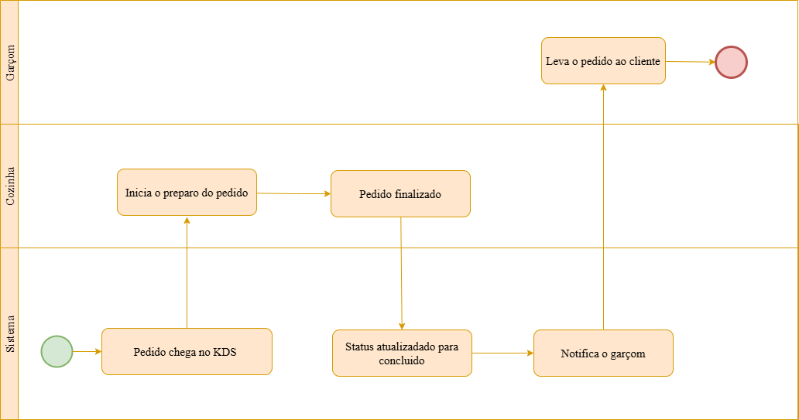
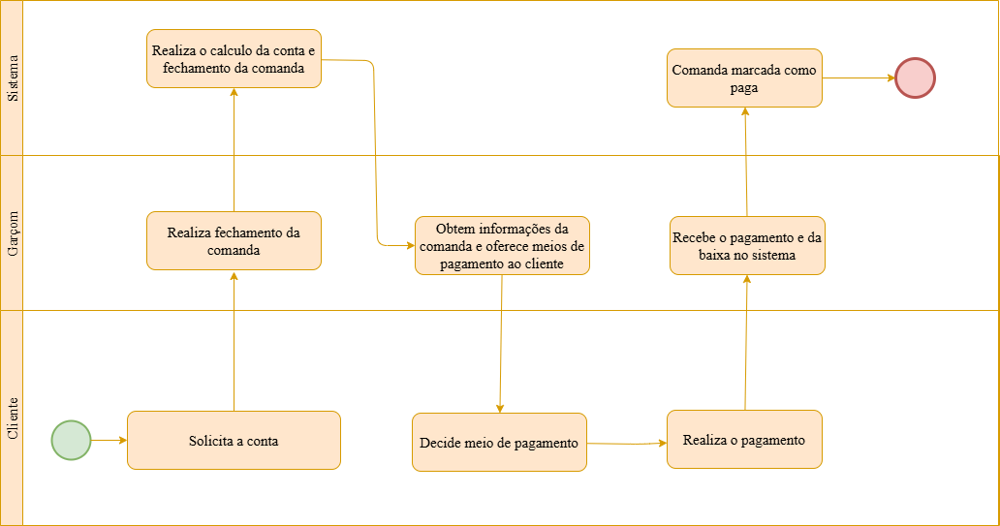
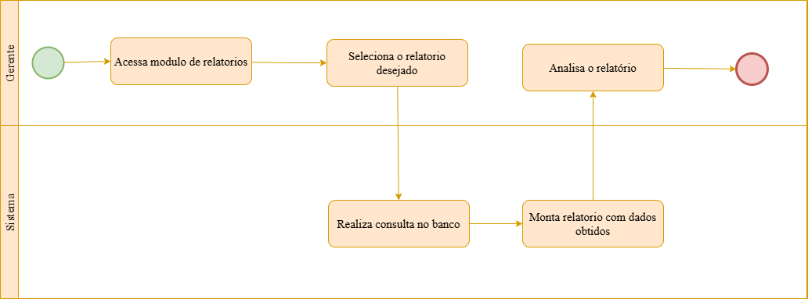
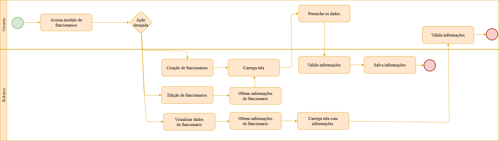
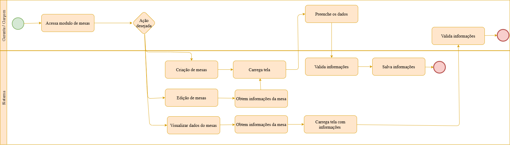

# Modelagem de Processos de Negócio - BPMN 2.0

## 1. Introdução

Este documento apresenta a modelagem completa dos processos de negócio do sistema FoodTrack utilizando a notação BPMN 2.0 (Business Process Model and Notation).

### 1.1. Metodologia
- **Notação:** BPMN 2.0
- **Nível de detalhamento:** Processos operacionais

## 2. Visão Geral dos Processos

### 2.1. Mapa de Processos

```
┌─────────────────────────────────────────────────┐
│          PROCESSOS DO FOODTRACK                 │
├─────────────────────────────────────────────────┤
│ 1. Autenticação e Controle de Acesso            │
│ 2. Gestão de Comandas e Pedidos                 │
│ 3. Preparo de Pedidos (KDS)                     │
│ 4. Pagamento e Fechamento de Comanda            │
│ 5. Geração de Relatórios                        │
│ 6. Gestão de Usuários                           │
│ 7. Gerenciamento de Cardápio                    │
│ 10. Controle de Mesas                           │
└─────────────────────────────────────────────────┘
```

---

## 3. Processos Detalhados

### 3.1. Processo 1: Autenticação e Controle de Acesso



---

### 3.2. Processo 2: Gestão de Comandas e Pedidos



---

### 3.3. Processo 3: Preparo de Pedidos (KDS)



---

### 3.6. Processo 4: Pagamento e Fechamento de Comanda



---

### 3.7. Processo 5: Geração de Relatórios



---

### 3.8. Processo 6: Gestão de Usuários (Funcionários)



---

### 3.9. Processo 7: Gerenciamento de Cardápio


---

### 3.10. Processo 8: Gerenciamento de Mesas



---